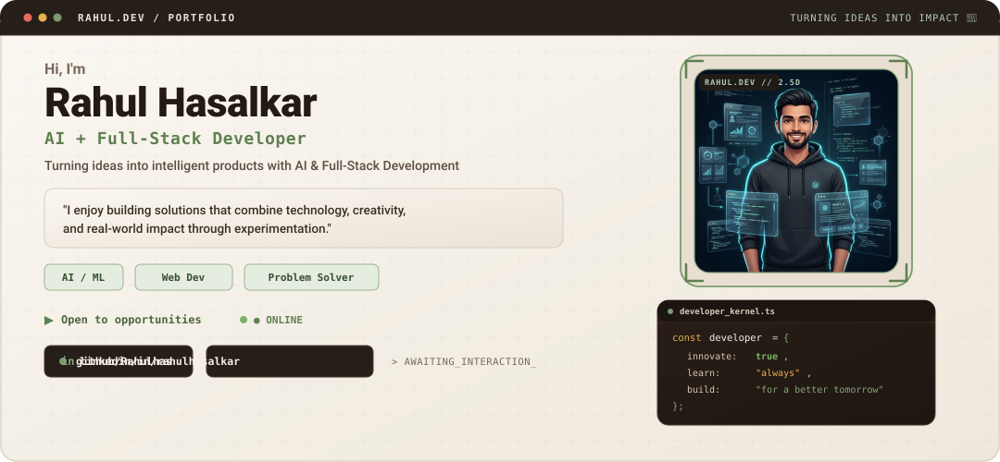
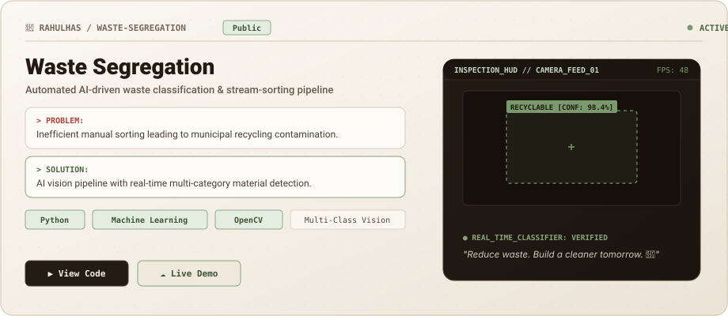
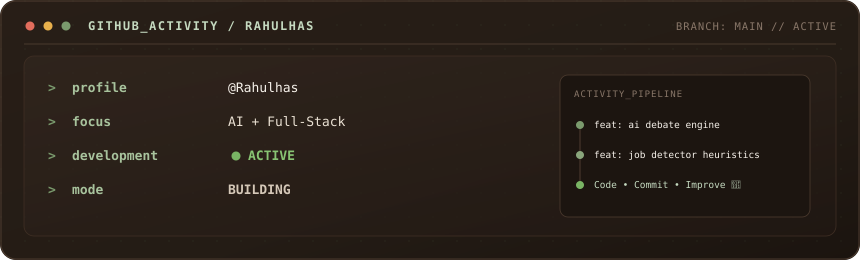
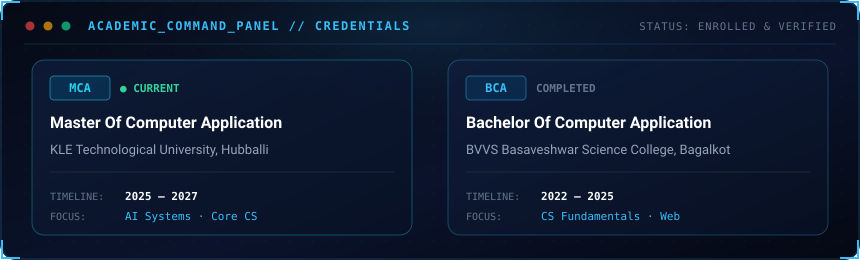

<!--
================================================================================
  RAHULHAS // REPOSITORY PROFILE CONFIGURATION & QUICK URL REPLACEMENT
  Update your personal links and project repositories below:
================================================================================
  [IDENTITY]
  NAME:                  Rahul Hasalkar
  ROLE:                  AI + Full-Stack Developer
  TAGLINE:               Turning Ideas into Intelligent Products with AI & Full-Stack Development

  [LINKS & CONTACT]
  GITHUB_URL:            https://github.com/Rahulhas
  LINKEDIN_URL:          https://linkedin.com/in/rahulhasalkar
  EMAIL_ADDRESS:         rahulhasalkar.dev@gmail.com

  [PROJECT SMART ACTIONS CONFIG]
  -- Waste Segregation (Hero Project)
  PROJECT_1_SOURCE:      https://github.com/Rahulhas (Replace with specific repo if created)
  PROJECT_1_DEMO:        (Omitted until live deployment URL is confirmed)
  PROJECT_1_CASE_STUDY:  (Omitted until published)

  -- AI Debate Coach
  PROJECT_2_SOURCE:      https://github.com/Rahulhas (Replace with specific repo if created)
  PROJECT_2_DEMO:        (Omitted until live deployment URL is confirmed)

  -- Fake Job Posting Detector
  PROJECT_3_SOURCE:      https://github.com/Rahulhas (Replace with specific repo if created)
  PROJECT_3_DEMO:        (Omitted until live deployment URL is confirmed)
================================================================================
-->

<div align="center">

<!-- HERO SECTION: AI COMMAND CENTER -->


</div>

<br/>

### 🛰️ System Identity &amp; Overview

```
USER_PROFILE // RAHUL HASALKAR
ROLE         // AI + Full-Stack Developer
TAGLINE      // Turning Ideas into Intelligent Products with AI & Full-Stack Development
```

I'm **Rahul**, an **AI and Full-Stack Developer** who enjoys turning ideas into intelligent, usable products through code, AI, and experimentation. Currently pursuing my **Master of Computer Applications (MCA)** at **KLE Technological University**, I focus on engineering end-to-end intelligent systems, reactive web interfaces, and robust backend pipelines.

---

### 💻 Current Session

<div align="center">
  
</div>

---

### 🌐 Tech Ecosystem

<div align="center">
  
</div>

<br/>

<details>
<summary><b>🔍 View Detailed Technology Breakdown</b></summary>

<br/>

| Domain | Technologies &amp; Frameworks | Core Capabilities |
| :--- | :--- | :--- |
| **AI / Code** | `Python`, `Java` | LLM Orchestration, Prompt Engineering, Object-Oriented Design |
| **Web / UI** | `TypeScript`, `HTML`, `Tailwind CSS` | High-Performance Interfaces, Component Architecture, Responsive Layouts |
| **Data** | `MySQL`, `DBMS` | Relational Data Modeling, Schema Normalization, Query Optimization |
| **Engineering** | `Git`, `DSA`, `SDLC` | Version Control, Algorithmic Optimization, Production Workflows |

</details>

---

### 🚀 Featured Projects

<!-- PROJECT 1 (HERO PROJECT): WASTE SEGREGATION -->
<div align="center">
  
</div>

<div align="right">

<!-- Smart Project Actions: Waste Segregation -->
[**`> SOURCE CODE`**](https://github.com/Rahulhas) &nbsp;•&nbsp; <sub><i>Live demo &amp; case study will unlock upon deployment</i></sub>

</div>

<br/>

<!-- PROJECT 2 & 3: SUPPORTING CARDS -->
<div align="center">
  
</div>

<div align="right">

<!-- Smart Project Actions: AI Debate Coach -->
[**`> SOURCE CODE`**](https://github.com/Rahulhas) &nbsp;•&nbsp; <sub><i>Verified Stack: React · Vite · Tailwind · TypeScript · FastAPI · Python · Gemini 1.5 Flash · Uvicorn</i></sub>

</div>

<br/>

<div align="center">
  
</div>

<div align="right">

<!-- Smart Project Actions: Fake Job Posting Detector -->
[**`> SOURCE CODE`**](https://github.com/Rahulhas) &nbsp;•&nbsp; <sub><i>Verified Stack: Next.js 14 · TypeScript · Tailwind · NextAuth · MongoDB · Redis · Gemini API</i></sub>

</div>

---

### 📊 GitHub Activity

<div align="center">
  <a href="https://github.com/Rahulhas?tab=repositories">
    
  </a>
</div>

---

### 🎓 Academic Credentials

<div align="center">
  
</div>

---

### 📡 Connect &amp; Dispatch

<div align="center">
  <a href="https://github.com/Rahulhas">
    
  </a>
</div>

<div align="center">

[](https://github.com/Rahulhas)
[](https://linkedin.com/in/rahulhasalkar)
[](mailto:rahulhasalkar.dev@gmail.com)

</div>

<br/>

<div align="center">
  <sub><code>RAHULHAS // AUTONOMOUS PROFILE NODE // DEPLOYED WITH ANTIGRAVITY ENGINE</code></sub>
</div>
